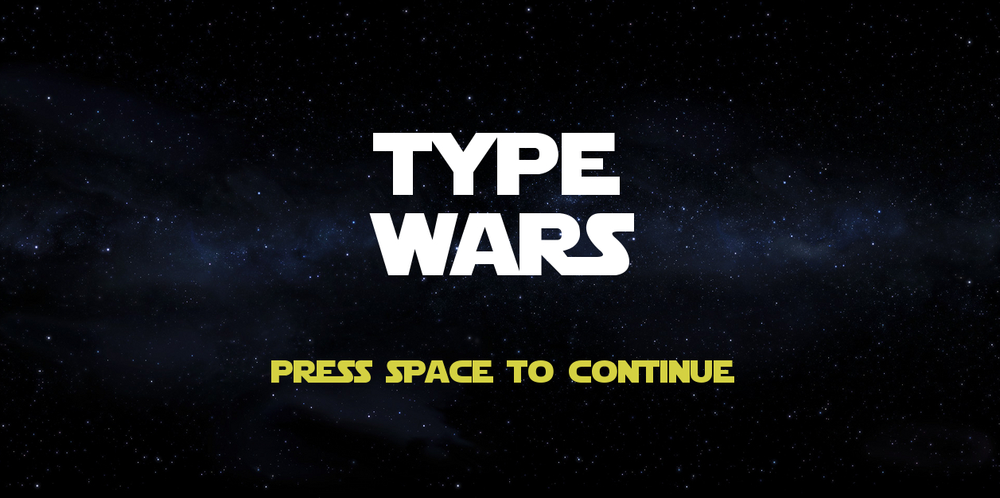
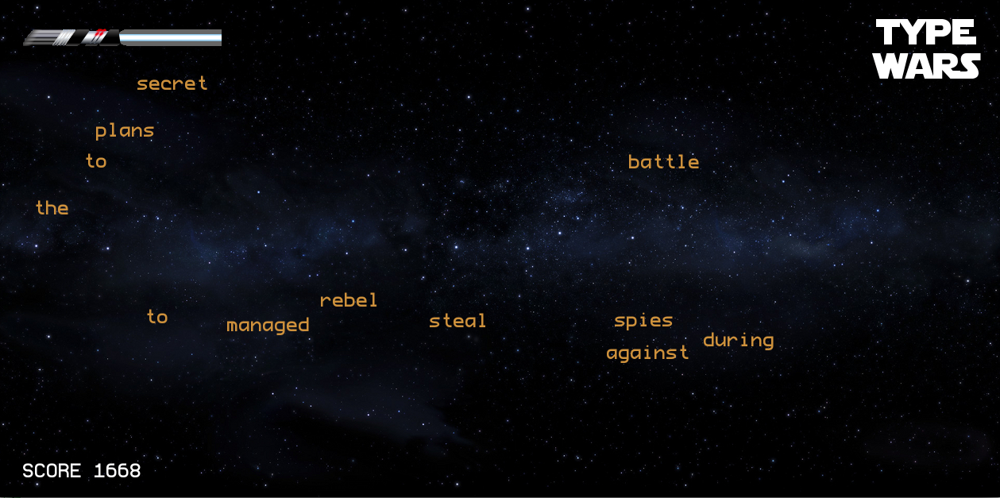

Type Wars is a Star Wars themed typing game. I wrote it with [Nabeelah Ali](http://www.linkedin.com/pub/nabeelah-ali/54/549/a3b) for a course on programming languages. It was written in [Clojure] (http://clojure.org/).

Clojure is very convenient as although it is relatively new it is very flexible, partly since it provides access to Java frameworks which we took advantage of. 



(import '(java.applet Applet)
        '(java.io File)
        '(java.net URL))



Easy as that.

Once I had a co-worker laughing at me for using [Haskell](http://www.haskell.org/haskellwiki/Haskell) as it is a purely-functional language which to him meant immutable states or in other words, it is impossible to work with. Clojure saves me from future mockery as, although a functional language it does allow for mutable states. This is done through what they call `atom`s.

Here is the set up for all states of the game.



(set-state! :score        (atom 0)
            :typed        (atom "")
            :game         (atom '())
            :words        (atom (get-lines wordfile))
            :missedwords  (atom 0)
            :ended        (atom -1)
            :quotesw      (atom (get-star-wars-quote))
)



These states are then altered when the gameplay begins.

Next are the intro screen and the game in action.

The words are taken from the Star Wars intro of episode III, they are randomly placed on the screen and have a random velocity. They fly across the screen and your objective is to type it in before it disappears. When you get a word it vanishes, when you miss one a part of your life-saber goes away. If the light-saber vanishes completely you lose.

Clojure allows for a very concise code. The whole game only amounts to about 300 lines in total, most functions only a few lines each.